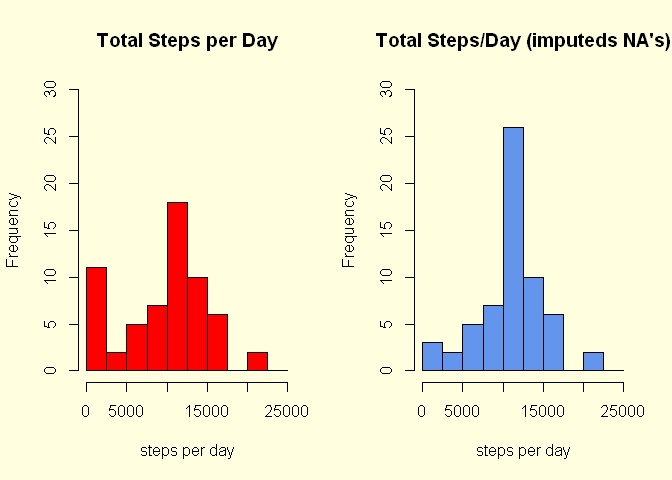

# Reproducible Research: Peer Assessment 1
Mario Maffioli  
Thursday, March 05, 2015  
## load required libraries

```r
library(dplyr, warn.conflicts = FALSE )
library(xtable)
library(chron)
library(lattice)
```

## Loading and preprocessing the data

Unzip the activity file and load it into memory

```r
rm(list=ls())
unzip("Activity.zip")
activity_raw <- read.csv("activity.csv")
```

Preprocess data sets required for analysis

```r
activity_raw_bydate <- 
    activity_raw %>% group_by(date)%>%
    summarise(steps = sum(steps, na.rm=T))

activity_raw_byinterval <- 
    activity_raw %>% group_by(interval)%>%
    summarise(steps_mean = mean(steps, na.rm=T))


# replace NA step values with corresponding interval mean

activity_no_na <- activity_raw

# convert interval id to factors
activity_no_na$interval  <- as.factor(activity_no_na$interval)

# create named vector to use as look-up table
named_means_vector <- 
    activity_raw_byinterval$steps_mean
names(named_means_vector) <- 
    activity_raw_byinterval$interval

# Extract indices of rows with NA values in steps
indx <- which(is.na(activity_raw$steps))

# Replace NA values with corresponding interval means
activity_no_na[indx,]$steps <- 
        named_means_vector[activity_no_na[indx,]$interval ]

activity_noNA_bydate <- 
    activity_no_na %>% group_by(date)%>%
    summarise(steps = sum(steps, na.rm=T))


# create augmented data frame with wend column
activity_no_na_day <- 
    activity_no_na %>%
        mutate(day=is.weekend(as.Date(date)))

# convert Wend  to factor
activity_no_na_day$day  <- as.factor(activity_no_na_day$day)

# label factor levels
levels(activity_no_na_day$day) <- 
    c("weekday", "weekend")

activity_no_na_day_byinterval <- 
    activity_no_na_day %>% group_by(interval, day)%>%
    summarise(steps_mean = mean(steps))


# activity_no_na_wday <- 
#     filter(activity_no_na_day, day=="weekday" )
# 
# activity_no_na_wend <- 
#     filter(activity_no_na_day, day=="weekend" )
# 
# activity_no_na_wday_byinterval <- 
#     activity_no_na_wday %>% group_by(interval)%>%
#     summarise(steps_mean = mean(steps, na.rm=T))
# 
# activity_no_na_wend_byinterval <- 
#     activity_no_na_wend %>% group_by(interval)%>%
#     summarise(steps_mean = mean(steps, na.rm=T))
# 
# rm(activity_no_na_wday)
# rm(activity_no_na_wend)
```


## What is mean total number of steps taken per day?

1. Total number of steps taken per day

Table with total number of steps taken per day

```r
tbl <- xtable(activity_raw_bydate,
           caption="Fig. 1.0\n Steps by date")
align(tbl) <- "|r|r|r|"
print (tbl,
      NA.string="NA",
      type = "html"
      )
```

<!-- html table generated in R 3.1.2 by xtable 1.7-4 package -->
<!-- Sat Mar 07 18:54:19 2015 -->
<table border=1>
<caption align="bottom"> Fig. 1.0
 Steps by date </caption>
<tr> <th>  </th> <th> date </th> <th> steps </th>  </tr>
  <tr> <td align="right"> 1 </td> <td align="right"> 2012-10-01 </td> <td align="right">   0 </td> </tr>
  <tr> <td align="right"> 2 </td> <td align="right"> 2012-10-02 </td> <td align="right"> 126 </td> </tr>
  <tr> <td align="right"> 3 </td> <td align="right"> 2012-10-03 </td> <td align="right"> 11352 </td> </tr>
  <tr> <td align="right"> 4 </td> <td align="right"> 2012-10-04 </td> <td align="right"> 12116 </td> </tr>
  <tr> <td align="right"> 5 </td> <td align="right"> 2012-10-05 </td> <td align="right"> 13294 </td> </tr>
  <tr> <td align="right"> 6 </td> <td align="right"> 2012-10-06 </td> <td align="right"> 15420 </td> </tr>
  <tr> <td align="right"> 7 </td> <td align="right"> 2012-10-07 </td> <td align="right"> 11015 </td> </tr>
  <tr> <td align="right"> 8 </td> <td align="right"> 2012-10-08 </td> <td align="right">   0 </td> </tr>
  <tr> <td align="right"> 9 </td> <td align="right"> 2012-10-09 </td> <td align="right"> 12811 </td> </tr>
  <tr> <td align="right"> 10 </td> <td align="right"> 2012-10-10 </td> <td align="right"> 9900 </td> </tr>
  <tr> <td align="right"> 11 </td> <td align="right"> 2012-10-11 </td> <td align="right"> 10304 </td> </tr>
  <tr> <td align="right"> 12 </td> <td align="right"> 2012-10-12 </td> <td align="right"> 17382 </td> </tr>
  <tr> <td align="right"> 13 </td> <td align="right"> 2012-10-13 </td> <td align="right"> 12426 </td> </tr>
  <tr> <td align="right"> 14 </td> <td align="right"> 2012-10-14 </td> <td align="right"> 15098 </td> </tr>
  <tr> <td align="right"> 15 </td> <td align="right"> 2012-10-15 </td> <td align="right"> 10139 </td> </tr>
  <tr> <td align="right"> 16 </td> <td align="right"> 2012-10-16 </td> <td align="right"> 15084 </td> </tr>
  <tr> <td align="right"> 17 </td> <td align="right"> 2012-10-17 </td> <td align="right"> 13452 </td> </tr>
  <tr> <td align="right"> 18 </td> <td align="right"> 2012-10-18 </td> <td align="right"> 10056 </td> </tr>
  <tr> <td align="right"> 19 </td> <td align="right"> 2012-10-19 </td> <td align="right"> 11829 </td> </tr>
  <tr> <td align="right"> 20 </td> <td align="right"> 2012-10-20 </td> <td align="right"> 10395 </td> </tr>
  <tr> <td align="right"> 21 </td> <td align="right"> 2012-10-21 </td> <td align="right"> 8821 </td> </tr>
  <tr> <td align="right"> 22 </td> <td align="right"> 2012-10-22 </td> <td align="right"> 13460 </td> </tr>
  <tr> <td align="right"> 23 </td> <td align="right"> 2012-10-23 </td> <td align="right"> 8918 </td> </tr>
  <tr> <td align="right"> 24 </td> <td align="right"> 2012-10-24 </td> <td align="right"> 8355 </td> </tr>
  <tr> <td align="right"> 25 </td> <td align="right"> 2012-10-25 </td> <td align="right"> 2492 </td> </tr>
  <tr> <td align="right"> 26 </td> <td align="right"> 2012-10-26 </td> <td align="right"> 6778 </td> </tr>
  <tr> <td align="right"> 27 </td> <td align="right"> 2012-10-27 </td> <td align="right"> 10119 </td> </tr>
  <tr> <td align="right"> 28 </td> <td align="right"> 2012-10-28 </td> <td align="right"> 11458 </td> </tr>
  <tr> <td align="right"> 29 </td> <td align="right"> 2012-10-29 </td> <td align="right"> 5018 </td> </tr>
  <tr> <td align="right"> 30 </td> <td align="right"> 2012-10-30 </td> <td align="right"> 9819 </td> </tr>
  <tr> <td align="right"> 31 </td> <td align="right"> 2012-10-31 </td> <td align="right"> 15414 </td> </tr>
  <tr> <td align="right"> 32 </td> <td align="right"> 2012-11-01 </td> <td align="right">   0 </td> </tr>
  <tr> <td align="right"> 33 </td> <td align="right"> 2012-11-02 </td> <td align="right"> 10600 </td> </tr>
  <tr> <td align="right"> 34 </td> <td align="right"> 2012-11-03 </td> <td align="right"> 10571 </td> </tr>
  <tr> <td align="right"> 35 </td> <td align="right"> 2012-11-04 </td> <td align="right">   0 </td> </tr>
  <tr> <td align="right"> 36 </td> <td align="right"> 2012-11-05 </td> <td align="right"> 10439 </td> </tr>
  <tr> <td align="right"> 37 </td> <td align="right"> 2012-11-06 </td> <td align="right"> 8334 </td> </tr>
  <tr> <td align="right"> 38 </td> <td align="right"> 2012-11-07 </td> <td align="right"> 12883 </td> </tr>
  <tr> <td align="right"> 39 </td> <td align="right"> 2012-11-08 </td> <td align="right"> 3219 </td> </tr>
  <tr> <td align="right"> 40 </td> <td align="right"> 2012-11-09 </td> <td align="right">   0 </td> </tr>
  <tr> <td align="right"> 41 </td> <td align="right"> 2012-11-10 </td> <td align="right">   0 </td> </tr>
  <tr> <td align="right"> 42 </td> <td align="right"> 2012-11-11 </td> <td align="right"> 12608 </td> </tr>
  <tr> <td align="right"> 43 </td> <td align="right"> 2012-11-12 </td> <td align="right"> 10765 </td> </tr>
  <tr> <td align="right"> 44 </td> <td align="right"> 2012-11-13 </td> <td align="right"> 7336 </td> </tr>
  <tr> <td align="right"> 45 </td> <td align="right"> 2012-11-14 </td> <td align="right">   0 </td> </tr>
  <tr> <td align="right"> 46 </td> <td align="right"> 2012-11-15 </td> <td align="right">  41 </td> </tr>
  <tr> <td align="right"> 47 </td> <td align="right"> 2012-11-16 </td> <td align="right"> 5441 </td> </tr>
  <tr> <td align="right"> 48 </td> <td align="right"> 2012-11-17 </td> <td align="right"> 14339 </td> </tr>
  <tr> <td align="right"> 49 </td> <td align="right"> 2012-11-18 </td> <td align="right"> 15110 </td> </tr>
  <tr> <td align="right"> 50 </td> <td align="right"> 2012-11-19 </td> <td align="right"> 8841 </td> </tr>
  <tr> <td align="right"> 51 </td> <td align="right"> 2012-11-20 </td> <td align="right"> 4472 </td> </tr>
  <tr> <td align="right"> 52 </td> <td align="right"> 2012-11-21 </td> <td align="right"> 12787 </td> </tr>
  <tr> <td align="right"> 53 </td> <td align="right"> 2012-11-22 </td> <td align="right"> 20427 </td> </tr>
  <tr> <td align="right"> 54 </td> <td align="right"> 2012-11-23 </td> <td align="right"> 21194 </td> </tr>
  <tr> <td align="right"> 55 </td> <td align="right"> 2012-11-24 </td> <td align="right"> 14478 </td> </tr>
  <tr> <td align="right"> 56 </td> <td align="right"> 2012-11-25 </td> <td align="right"> 11834 </td> </tr>
  <tr> <td align="right"> 57 </td> <td align="right"> 2012-11-26 </td> <td align="right"> 11162 </td> </tr>
  <tr> <td align="right"> 58 </td> <td align="right"> 2012-11-27 </td> <td align="right"> 13646 </td> </tr>
  <tr> <td align="right"> 59 </td> <td align="right"> 2012-11-28 </td> <td align="right"> 10183 </td> </tr>
  <tr> <td align="right"> 60 </td> <td align="right"> 2012-11-29 </td> <td align="right"> 7047 </td> </tr>
  <tr> <td align="right"> 61 </td> <td align="right"> 2012-11-30 </td> <td align="right">   0 </td> </tr>
   </table>


Create and display histogram

```r
par(mfrow = c(1,1))
hist1 <- hist(activity_raw_bydate$steps, breaks=seq(0,25000,2500),xlab = "steps per day", main="Total Steps/Day", col="red", ylim=c(0,25))
```

 

Compute mean and median for total number of steps

```r
mean(activity_raw_bydate$steps, na.rm=T)
```

```
## [1] 9354.23
```

```r
median(activity_raw_bydate$steps, na.rm=T)
```

```
## [1] 10395
```


## What is the average daily activity pattern?

Table showing first 20 rows of average number of steps taken per interval

```r
tbl2 <- xtable(head(activity_raw_byinterval,20),
           caption="Fig. 2.0\n Steps by interval")
align(tbl2) <- "|r|c|r|"
print (tbl2,
      NA.string="NA",
      type = "html"
      )
```

<!-- html table generated in R 3.1.2 by xtable 1.7-4 package -->
<!-- Sat Mar 07 18:54:19 2015 -->
<table border=1>
<caption align="bottom"> Fig. 2.0
 Steps by interval </caption>
<tr> <th>  </th> <th> interval </th> <th> steps_mean </th>  </tr>
  <tr> <td align="right"> 1 </td> <td align="center">   0 </td> <td align="right"> 1.72 </td> </tr>
  <tr> <td align="right"> 2 </td> <td align="center">   5 </td> <td align="right"> 0.34 </td> </tr>
  <tr> <td align="right"> 3 </td> <td align="center">  10 </td> <td align="right"> 0.13 </td> </tr>
  <tr> <td align="right"> 4 </td> <td align="center">  15 </td> <td align="right"> 0.15 </td> </tr>
  <tr> <td align="right"> 5 </td> <td align="center">  20 </td> <td align="right"> 0.08 </td> </tr>
  <tr> <td align="right"> 6 </td> <td align="center">  25 </td> <td align="right"> 2.09 </td> </tr>
  <tr> <td align="right"> 7 </td> <td align="center">  30 </td> <td align="right"> 0.53 </td> </tr>
  <tr> <td align="right"> 8 </td> <td align="center">  35 </td> <td align="right"> 0.87 </td> </tr>
  <tr> <td align="right"> 9 </td> <td align="center">  40 </td> <td align="right"> 0.00 </td> </tr>
  <tr> <td align="right"> 10 </td> <td align="center">  45 </td> <td align="right"> 1.47 </td> </tr>
  <tr> <td align="right"> 11 </td> <td align="center">  50 </td> <td align="right"> 0.30 </td> </tr>
  <tr> <td align="right"> 12 </td> <td align="center">  55 </td> <td align="right"> 0.13 </td> </tr>
  <tr> <td align="right"> 13 </td> <td align="center"> 100 </td> <td align="right"> 0.32 </td> </tr>
  <tr> <td align="right"> 14 </td> <td align="center"> 105 </td> <td align="right"> 0.68 </td> </tr>
  <tr> <td align="right"> 15 </td> <td align="center"> 110 </td> <td align="right"> 0.15 </td> </tr>
  <tr> <td align="right"> 16 </td> <td align="center"> 115 </td> <td align="right"> 0.34 </td> </tr>
  <tr> <td align="right"> 17 </td> <td align="center"> 120 </td> <td align="right"> 0.00 </td> </tr>
  <tr> <td align="right"> 18 </td> <td align="center"> 125 </td> <td align="right"> 1.11 </td> </tr>
  <tr> <td align="right"> 19 </td> <td align="center"> 130 </td> <td align="right"> 1.83 </td> </tr>
  <tr> <td align="right"> 20 </td> <td align="center"> 135 </td> <td align="right"> 0.17 </td> </tr>
   </table>


Select interval with highest average number of steps

```r
max_step_mean <- filter(activity_raw_byinterval, 
       steps_mean == max(steps_mean))
max_step_mean
```

```
## Source: local data frame [1 x 2]
## 
##   interval steps_mean
## 1      835   206.1698
```

Plot time series of average steps per interval across all days

```r
x <- activity_raw_byinterval$interval
y <- activity_raw_byinterval$steps_mean
plot(x,y, type="l", xlab=" 5-minute interval ",
     ylab="average number of steps taken",
     main="Avg. Steps Taken per Interval - All Days", col= "blue", lwd=2)
abline(v = 835, h= 206.1698, lty=2, col="red")
grid(lwd = 2)
```

 

## Imputing missing values

Find total number of NA's in steps column of raw activity file

```r
sum(is.na(activity_raw$steps))
```

```
## [1] 2304
```

Devise a strategy for filling in all of the missing values in the dataset. The strategy does not need to be sophisticated. For example, you could use the mean/median for that day, or the mean for that 5-minute interval, etc.

*Strategy*

1. Make a copy of the raw activity data frame.
2. Extract from this copy the indices of the rows with NA values in the 'steps' column.
3. Using the 'activity_raw_byinterval' data frame, create a named vector with the interval means as values and the interval-id as the names. This vector will the used as a look-up table in the next step.
4. Assign the corresponding interval mean to the 'steps' NA value, thus imputing  the interval mean as a replacement for the NA value.


Create a new dataset that is equal to the original dataset but with the missing data filled in.

```r
tbl3 <- xtable(head(activity_no_na,20),
           caption="Fig. 3.0\n Activity without NAs")
align(tbl3) <- "|r|r|c|r|"
print (tbl3,
      type = "html"
      )
```

<!-- html table generated in R 3.1.2 by xtable 1.7-4 package -->
<!-- Sat Mar 07 18:54:20 2015 -->
<table border=1>
<caption align="bottom"> Fig. 3.0
 Activity without NAs </caption>
<tr> <th>  </th> <th> steps </th> <th> date </th> <th> interval </th>  </tr>
  <tr> <td align="right"> 1 </td> <td align="right"> 1.72 </td> <td align="center"> 2012-10-01 </td> <td align="right"> 0 </td> </tr>
  <tr> <td align="right"> 2 </td> <td align="right"> 0.34 </td> <td align="center"> 2012-10-01 </td> <td align="right"> 5 </td> </tr>
  <tr> <td align="right"> 3 </td> <td align="right"> 0.13 </td> <td align="center"> 2012-10-01 </td> <td align="right"> 10 </td> </tr>
  <tr> <td align="right"> 4 </td> <td align="right"> 0.15 </td> <td align="center"> 2012-10-01 </td> <td align="right"> 15 </td> </tr>
  <tr> <td align="right"> 5 </td> <td align="right"> 0.08 </td> <td align="center"> 2012-10-01 </td> <td align="right"> 20 </td> </tr>
  <tr> <td align="right"> 6 </td> <td align="right"> 2.09 </td> <td align="center"> 2012-10-01 </td> <td align="right"> 25 </td> </tr>
  <tr> <td align="right"> 7 </td> <td align="right"> 0.53 </td> <td align="center"> 2012-10-01 </td> <td align="right"> 30 </td> </tr>
  <tr> <td align="right"> 8 </td> <td align="right"> 0.87 </td> <td align="center"> 2012-10-01 </td> <td align="right"> 35 </td> </tr>
  <tr> <td align="right"> 9 </td> <td align="right"> 0.00 </td> <td align="center"> 2012-10-01 </td> <td align="right"> 40 </td> </tr>
  <tr> <td align="right"> 10 </td> <td align="right"> 1.47 </td> <td align="center"> 2012-10-01 </td> <td align="right"> 45 </td> </tr>
  <tr> <td align="right"> 11 </td> <td align="right"> 0.30 </td> <td align="center"> 2012-10-01 </td> <td align="right"> 50 </td> </tr>
  <tr> <td align="right"> 12 </td> <td align="right"> 0.13 </td> <td align="center"> 2012-10-01 </td> <td align="right"> 55 </td> </tr>
  <tr> <td align="right"> 13 </td> <td align="right"> 0.32 </td> <td align="center"> 2012-10-01 </td> <td align="right"> 100 </td> </tr>
  <tr> <td align="right"> 14 </td> <td align="right"> 0.68 </td> <td align="center"> 2012-10-01 </td> <td align="right"> 105 </td> </tr>
  <tr> <td align="right"> 15 </td> <td align="right"> 0.15 </td> <td align="center"> 2012-10-01 </td> <td align="right"> 110 </td> </tr>
  <tr> <td align="right"> 16 </td> <td align="right"> 0.34 </td> <td align="center"> 2012-10-01 </td> <td align="right"> 115 </td> </tr>
  <tr> <td align="right"> 17 </td> <td align="right"> 0.00 </td> <td align="center"> 2012-10-01 </td> <td align="right"> 120 </td> </tr>
  <tr> <td align="right"> 18 </td> <td align="right"> 1.11 </td> <td align="center"> 2012-10-01 </td> <td align="right"> 125 </td> </tr>
  <tr> <td align="right"> 19 </td> <td align="right"> 1.83 </td> <td align="center"> 2012-10-01 </td> <td align="right"> 130 </td> </tr>
  <tr> <td align="right"> 20 </td> <td align="right"> 0.17 </td> <td align="center"> 2012-10-01 </td> <td align="right"> 135 </td> </tr>
   </table>

Make a histogram of the total number of steps taken each day (with the imputed NA values)

```r
op <- par(mfrow = c(1, 2), bg = "lightyellow")

plot(hist1,xlab = "steps per day", main="Total Steps per Day", col="red", ylim=c(0,30))

hist2 <- hist(activity_noNA_bydate$steps, breaks=seq(0,25000,2500),xlab = "steps per day", main="Total Steps/Day (imputeds NA's)", col="cornflowerblue", ylim=c(0,30))
```

 

```r
par(op)

# colors()[grep("yellow",colors())]
```

Compute mean and median for total number of steps

```r
mean(activity_noNA_bydate$steps)
```

```
## [1] 10766.19
```

```r
median(activity_noNA_bydate$steps)
```

```
## [1] 10766.19
```
## Are there differences in activity patterns between weekdays and weekends?


```r
activity_no_na_day_byinterval$interval <- as.integer(activity_no_na_day_byinterval$interval)

# With Latice
xyplot(steps_mean ~ interval | day, data=activity_no_na_day_byinterval, type = "l", layout = c(1, 2),ylab="avg. number steps", main="Average Steps by Five Minute Interval")
```

 


